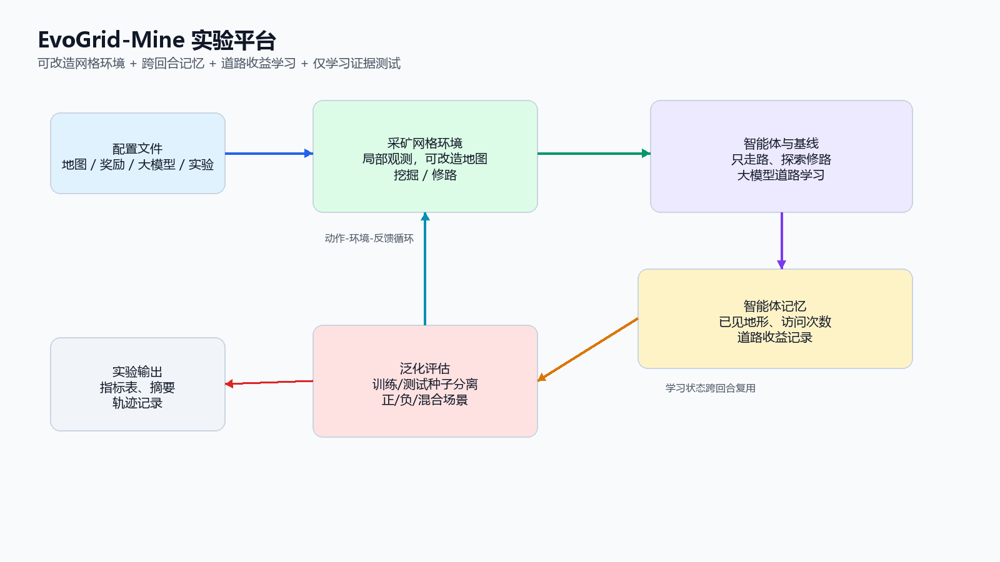
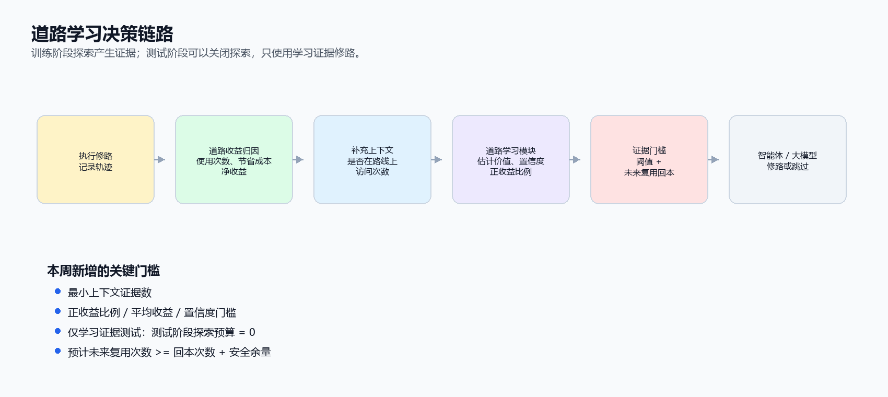
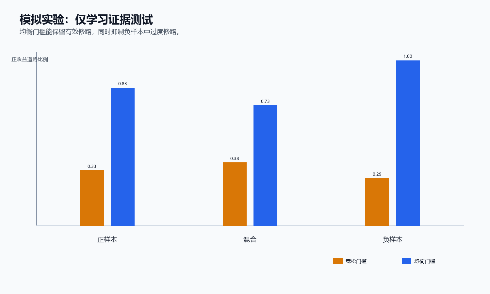
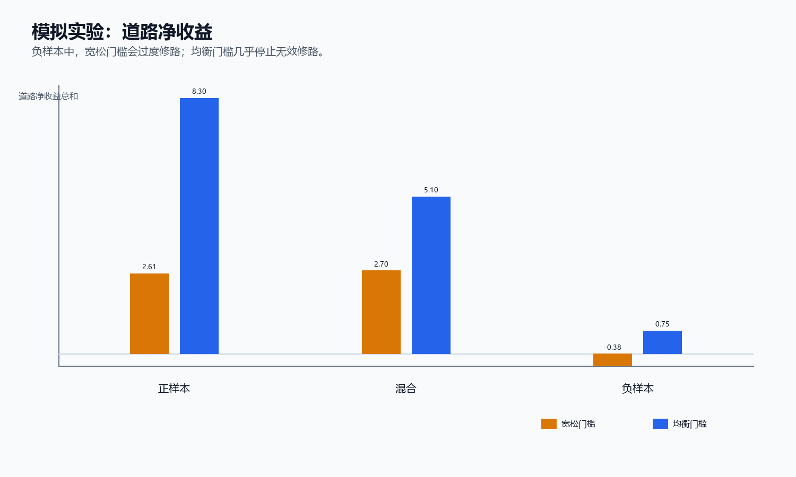
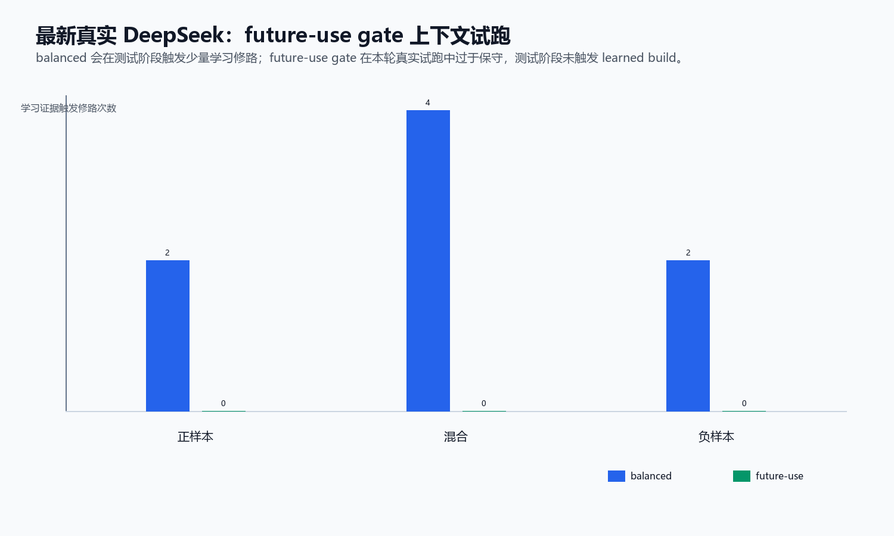
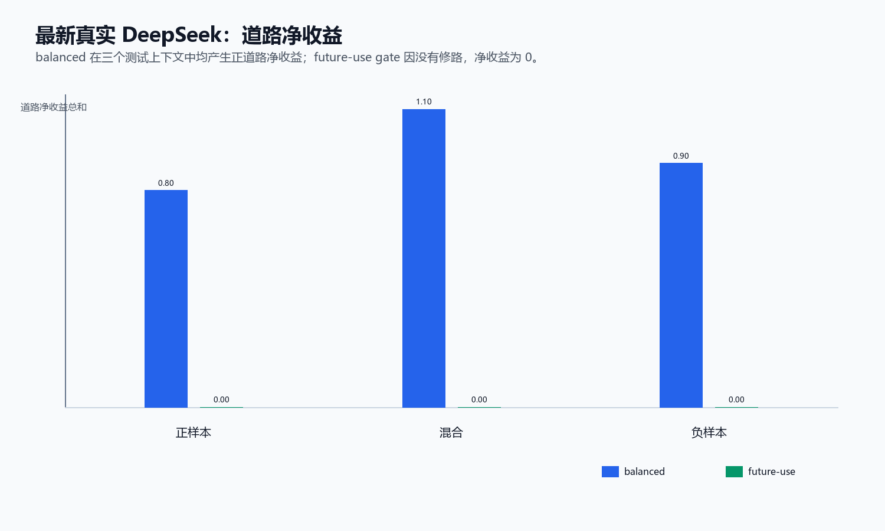
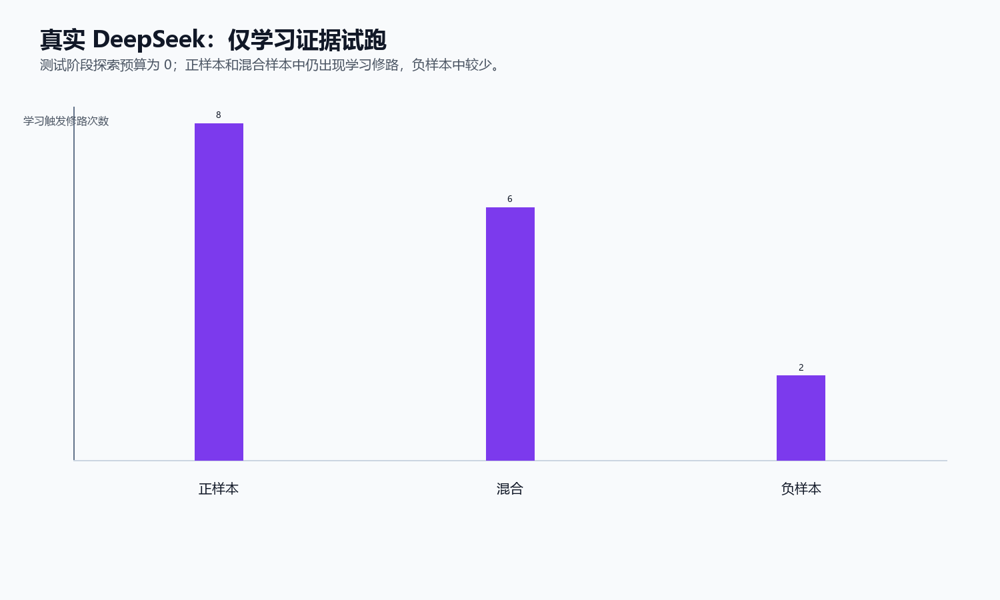
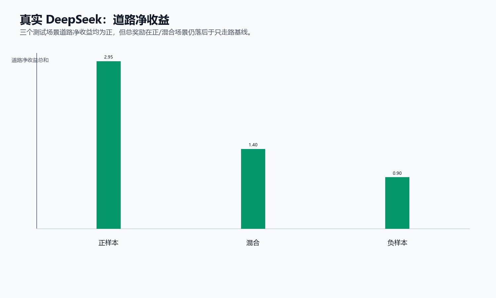
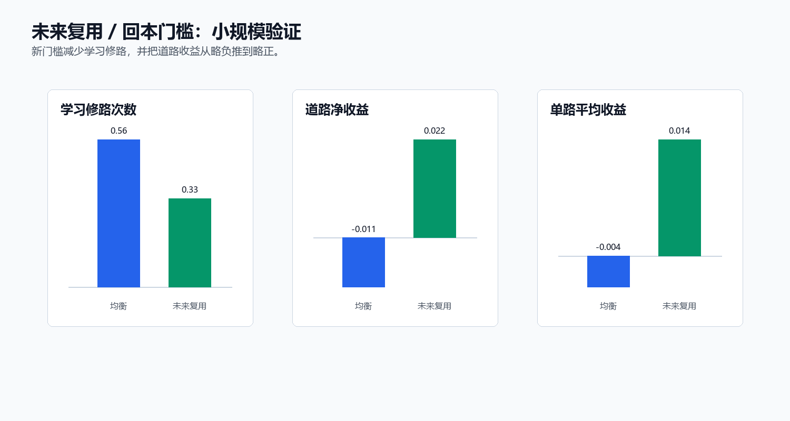

# 本周工作报告：面向智能体自进化的 EvoGrid-Mine 实验平台设计与验证

## 1. 本周工作概述

本周的主要工作是设计并实现了一套用于研究“智能体自进化”的实验平台，命名为 EvoGrid-Mine。这个平台构造了一个可以观察“智能体是否会在经验中改变自己行为策略”的小型实验系统。

我将“智能体自进化”具体化为一个可测量的问题：智能体在一个可改造的采矿网格环境中，能否通过多轮交互逐渐学会哪些环境改造行为是有价值的。例如，修路本身会消耗一步动作和一定成本，但如果这条路未来会被反复使用，就可能节省更多移动代价。智能体需要从历史经验中判断“什么时候值得修路”，而不是被直接写死为“遇到粗糙地形就修路”。

因此，本周工作的完整内容包括：

- 设计一个可被智能体改造的网格采矿环境；
- 实现局部观测、记忆、道路收益记录和实验指标；
- 实现多类 baseline 和 LLM 相关智能体；
- 设计道路学习机制，使智能体能从历史道路收益中形成后续决策依据；
- 搭建训练、评估、可视化和实验输出管线；
- 运行 mock LLM 和真实 DeepSeek pilot 实验，验证机制是否能跑通。

图 1 是本周完成的平台总览。整个系统由配置、环境、智能体、记忆、评估和输出组成。环境负责提供可改造任务，智能体负责行动和学习，记忆模块记录跨回合经验，评估模块负责判断智能体是否真的学会了更合理的环境改造策略。

## 2. 实验环境设计：EvoGrid-Mine 是什么

为了研究智能体自进化，我设计了一个采矿网格世界。这个环境足够简单，便于观察和统计；同时又包含长期收益和环境改造，使它不只是普通的最短路问题。

### 2.1 地图元素

EvoGrid-Mine 中的地图是一个二维网格。每个格子可以是不同类型：

| 元素 | 含义 |
| --- | --- |
| 基地 `BASE` | 智能体出发点，也是矿石交付点 |
| 矿石 `ORE` | 智能体需要到达并采集的资源 |
| 普通地面 `GROUND` | 正常通行格子 |
| 粗糙地形 `ROUGH` | 可以通行，但移动代价更高 |
| 道路 `ROAD` | 由智能体修建，能降低后续通行代价 |
| 障碍 `OBSTACLE` | 不可通行 |

任务目标是：智能体从基地出发，寻找矿石，采矿后返回基地交付。这个目标本身类似采矿运输任务，但关键在于地图可以被智能体改变。智能体可以在某些格子上修路，使后续经过这条路线时移动成本降低。

图 2 展示了环境中的三类地图样本。正样本中，粗糙地形主要出现在基地和矿石之间的运输路线附近，修路往往有用；负样本中，粗糙地形更多分布在不常经过的位置，盲目修路会浪费动作；混合样本同时包含有用和误导性的修路机会。这样的环境设计是为了检验智能体是否能区分不同上下文，而不是简单增加修路次数。

### 2.2 智能体动作

智能体在每一步可以执行低层动作，例如：

| 动作 | 含义 |
| --- | --- |
| `MOVE_UP / MOVE_DOWN / MOVE_LEFT / MOVE_RIGHT` | 在地图中移动 |
| `MINE` | 在矿石位置采集资源 |
| `DIG` | 挖掘部分地形 |
| `BUILD_ROAD` | 在当前位置修建道路 |

其中 `BUILD_ROAD` 是本实验最重要的动作。它代表智能体对环境的主动改造。修路不是即时收益动作，因为修路本身消耗步数；它只有在未来被多次使用时才可能带来收益。因此，它适合作为“智能体能否从经验中形成长期策略”的观测对象。

### 2.3 奖励与道路收益

环境会记录两类结果。

第一类是普通任务结果，例如：

- 交付了多少矿石；
- 总 episode reward；
- 走了多少步；
- 是否执行了非法动作。

第二类是环境改造结果，例如：

- 修了多少条路；
- 道路被使用了多少次；
- 道路节省了多少移动成本；
- 修路本身花了多少成本；
- 道路净收益 `road_net_payoff` 是否为正；
- 正收益道路比例 `positive_road_ratio`。

这类指标让我们可以判断：智能体不是只在追求表面 reward，而是真的在学习环境改造行为是否值得。

### 2.4 局部观测与记忆

如果智能体一开始就能看到完整地图和全部矿点真值，那么任务会退化成路径规划。因此平台支持 partial observation，即智能体只能看到局部视野、当前位置、最近事件和自己的历史记忆。

记忆模块会保存：

- 已经见过的地形；
- 访问过的位置；
- 曾经修过的道路；
- 每条道路后续是否被使用；
- 道路带来的净收益；
- 上一轮反思或策略摘要。

这样，智能体需要通过多轮探索逐渐积累经验，再把经验用于后续决策。这就是本平台中“自进化”的基本来源。

## 3. 平台代码结构

本周实现的代码围绕上述环境和研究问题展开，主要分为六层。

### 3.1 环境层

环境代码位于 `evogrid/envs/`。它负责地图状态、动作执行、奖励计算、道路收益记录和局部观测生成。

主要模块包括：

| 文件 | 作用 |
| --- | --- |
| `evogrid_mine_env.py` | 采矿网格环境主体 |
| `map_builder.py` | 固定地图、随机地图和受控走廊地图生成 |
| `map_state.py` | 地图状态、智能体位置、矿石和道路状态 |
| `reward.py` | 任务奖励和修路成本 |
| `road_credit.py` | 道路节省成本、使用次数和净收益归因 |
| `metrics.py` | 回合级指标统计 |

### 3.2 智能体层

智能体代码位于 `evogrid/agents/`。本周实现了多种智能体，用于区分“路径能力”“规则修路能力”“经验学习能力”和“LLM 决策能力”。

| 智能体 | 作用 |
| --- | --- |
| `RandomAgent` | 随机基线 |
| `GreedyAgent` | 基于简单规则采矿 |
| `RouteOnlyAgent` | 只走路线，不主动修路 |
| `RuleRoadOracleAgent` | 使用规则和更多信息的修路上界检查 |
| `LearnedRoadAgent` | 根据历史道路收益估计决定是否修路 |
| `LLMRoadLearningAgent` | 将道路学习证据提供给大模型，由大模型决定是否修路 |
| `SelfEvolutionAgent` | 面向局部观测、记忆和反思的自进化智能体接口 |

### 3.3 LLM 层

LLM 代码位于 `evogrid/llm/`。这一层不直接控制环境，而是负责 DeepSeek API 调用、prompt 构造、结构化输出解析和失败 fallback。

为了保证实验可控，LLM 输出必须是结构化 JSON，并经过字段校验和动作合法性过滤。如果 DeepSeek 调用失败、返回非法 JSON 或给出不可执行动作，智能体会退回到安全策略。

### 3.4 道路学习层

道路学习相关逻辑位于 `evogrid/agents/road_learning.py`、`road_evidence.py`、`road_context.py` 和 `shaping_opportunity.py`。

这部分的关键原则是：机会检测器不能替智能体做决定。`ShapingOpportunity` 只告诉智能体“当前位置可能适合修路”，但不会自动执行 `BUILD_ROAD`。是否修路必须由智能体根据历史收益、置信度、上下文和当前目标来决定。

### 3.5 实验脚本层

实验脚本位于 `scripts/`，用于统一运行不同实验组。

主要入口包括：

| 脚本 | 作用 |
| --- | --- |
| `run_self_evolution_experiment.py` | 自进化实验入口 |
| `run_road_learning_ablation.py` | 道路学习消融实验 |
| `run_exploration_road_learning.py` | 探索式道路学习实验 |
| `run_llm_road_learning.py` | 大模型介入的道路学习实验 |
| `run_generalization_eval.py` | 训练/测试种子分离的泛化评估 |
| `generate_weekly_report_assets.py` | 周报图片生成 |

### 3.6 评估与可视化层

评估代码位于 `evogrid/evaluation/`，可视化代码位于 `evogrid/visualization/`。实验输出统一保存为 CSV、JSON、trace 和图片，便于复查。

输出包括：

- `metrics.csv`：每个 episode 的指标；
- `group_comparison.csv`：不同智能体组的对比；
- `context_comparison.csv`：正样本、负样本、混合样本的上下文对比；
- `summary.json`：完整实验摘要；
- `llm_trace.jsonl`：LLM 每次决策的输入、输出和 fallback 情况；
- 轨迹和热力图：用于观察智能体实际走法。

## 4. 自进化机制：智能体如何从经验中改变行为

本平台中的自进化不是指修改模型参数本身，而是指智能体通过环境交互形成可复用的经验状态，并在后续回合中改变决策。

图 3 展示了道路学习机制。整个过程可以分成六步：

1. 智能体在地图中移动，遇到可能值得修路的位置；
2. `ShapingOpportunity` 生成一个候选修路机会；
3. 智能体选择修路或跳过；
4. 如果修路，环境在后续步骤中记录这条路是否被使用；
5. `RoadCreditTracker` 计算道路节省成本、修路成本和净收益；
6. `RoadLearningModule` 将历史收益转成 `learned_estimate`，供下一轮智能体或 LLM 决策使用。

由此形成一个闭环：

局部观察 -> 行动探索 -> 收益归因 -> 记忆更新 -> 证据估计 -> 后续决策变化。

为了判断这是否真的发生，平台记录了多种指标：

| 指标 | 含义 |
| --- | --- |
| 历史道路价值估计（`learned_value`） | 历史经验估计出的道路价值 |
| 置信度（`confidence`） | 当前估计的置信度 |
| 正收益比例（`positive_rate`） | 类似上下文中道路为正收益的比例 |
| 学习触发修路次数（`llm_learned_build_count`） | 由学习证据触发的大模型修路次数 |
| 道路净收益（`road_net_payoff`） | 道路总净收益 |
| 正收益道路比例（`positive_road_ratio`） | 修出的道路中正收益道路比例 |
| 强证据下修路概率（`p_build_given_strong_learned_evidence`） | 有强学习证据时实际修路概率 |

这样，报告中不只看“reward 是否变高”，而是能具体检查智能体有没有把历史经验转化成更有选择性的修路行为。

## 5. 实验设计

为了验证平台和机制，本周设计了几类对照组。

| 实验组 | 目的 |
| --- | --- |
| 只走路线组（`route_only`） | 只采矿和运输，不修路，作为无环境塑造基线 |
| 无道路学习组（`llm_no_road_learning`） | 大模型或策略可以行动，但不使用道路学习证据 |
| 宽松门槛组（`llm_with_road_learning_loose_threshold`） | 使用道路学习证据，但证据门槛较宽松 |
| 均衡门槛组（`llm_with_road_learning_balanced_threshold`） | 使用道路学习证据，证据门槛较均衡 |
| 中等门槛组（`llm_with_road_learning_medium_threshold`） | 更保守的证据门槛 |
| 严格门槛组（`llm_with_road_learning_strict_threshold`） | 最保守的证据门槛 |
| 未来复用组（`llm_with_road_learning_balanced_future_use_threshold`） | 在均衡门槛基础上加入未来复用回本判断 |

这些组不是为了展示“某个方法一定最高分”，而是为了回答几个机制性问题：

- 没有道路学习时，智能体会不会盲目修路；
- 有道路学习时，智能体是否更倾向于在正收益证据处修路；
- 宽松门槛是否会导致负样本中过度修路；
- 均衡门槛是否能在 positive、mixed、negative 场景中表现出不同策略；
- 真实 DeepSeek 是否能读取学习证据并产生结构化决策。

## 6. 实验结果

### 6.1 Mock LLM 上下文实验

首先使用 mock LLM 验证完整机制。mock LLM 的作用是排除 API 波动，先确认平台、指标、道路收益记录和决策接口是否正确。

在上下文切分实验中，测试地图被分成 positive、mixed、negative 三类。测试阶段关闭探索预算，只允许智能体使用训练阶段形成的道路学习证据。因此，如果智能体还能修路，说明它使用的是历史经验，而不是测试时随机探索。

主要结果如下：

| 场景 | 宽松门槛：学习触发修路数 | 宽松门槛：正收益道路数 | 宽松门槛：道路净收益 | 均衡门槛：学习触发修路数 | 均衡门槛：正收益道路数 | 均衡门槛：道路净收益 |
| --- | ---: | ---: | ---: | ---: | ---: | ---: |
| 正样本 | 21 | 7 | 2.61 | 18 | 15 | 8.30 |
| 混合样本 | 21 | 8 | 2.70 | 11 | 8 | 5.10 |
| 负样本 | 21 | 6 | -0.38 | 1 | 1 | 0.75 |

这个结果说明，宽松门槛虽然会产生更多修路行为，但它并不真正“聪明”：在 negative 场景中仍然修了 21 条 learned roads，导致道路净收益为负。balanced 门槛修路更少，但能明显抑制 negative 场景中的误修，同时在 positive 和 mixed 场景中保留正收益道路。

因此，这个实验支持一个结论：智能体自进化不能只看新行为是否出现，还要看新行为是否被上下文调节。更好的策略不是“多修路”，而是“在值得修的时候修路”。

### 6.2 证据密度实验

另一个实验比较了不同证据门槛。结果如下：

| 实验组 | 测试阶段每回合学习触发修路数 | 测试阶段正收益道路比例 | 测试阶段道路净收益 | 测试阶段单条道路平均收益 |
| --- | ---: | ---: | ---: | ---: |
| 宽松门槛 | 1.125 | 0.2500 | 0.1623 | 0.0541 |
| 均衡门槛 | 0.475 | 0.2125 | 0.2388 | 0.1213 |
| 中等/严格门槛 | 0.000 | 0.0000 | 0.0000 | 0.0000 |

balanced threshold 的特点是修路次数更少，但单条道路平均收益更高。medium 和 strict 门槛过于保守，几乎不触发学习修路。因此，当前比较合适的策略是 balanced，而不是越宽松越好，也不是越保守越好。

### 6.3 最新真实 DeepSeek + future-use gate 上下文试跑

在 mock LLM 跑通后，我进一步运行了真实 DeepSeek 小规模试跑。这一轮实验同时比较了两个真实 LLM 组：

- `llm_with_road_learning_balanced_threshold`：使用 balanced 道路学习证据门槛；
- `llm_with_road_learning_balanced_future_use_threshold`：在 balanced 基础上加入未来复用/回本门槛。

实验设置如下：

| 设置项 | 数值 |
| --- | ---: |
| 训练地图种子数 | 10 |
| 每个训练种子的回合数 | 4 |
| 每组训练回合总数 | 40 |
| 测试地图种子数 | 10 |
| 测试上下文 | 正样本 / 混合样本 / 负样本 |
| 每组测试回合总数 | 30 |
| 每个回合最大步数 | 220 |
| 训练阶段探索修路预算 | 每轮最多 3 次探索修路 |
| 测试阶段探索修路预算 | 0 |
| 测试阶段学习触发修路预算 | 每轮最多 3 次 |

LLM 调用不是“每 N 步固定调用一次”，而是事件触发：只有当前位置出现可修路候选机会，并且探索预算或学习证据门槛允许时，才会调用 DeepSeek。训练阶段为了产生道路收益样本，调用更频繁；测试阶段关闭探索预算后，只有出现足够强的历史学习证据才会调用 LLM。

实际调用频率如下：

| 实验组 | 训练阶段平均大模型调用次数/回合 | 测试阶段平均大模型调用次数/回合 |
| --- | ---: | ---: |
| 无道路学习组 | 41.925 | 0.000 |
| 均衡门槛组 | 43.775 | 0.267 |
| 未来复用组 | 46.250 | 0.000 |

这个实验的重点不是证明最终性能已经最优，而是检查真实 DeepSeek 是否能读取道路学习证据、输出结构化决策，并在 positive、mixed、negative 三类上下文中留下可解释的行为差异。

最新真实 DeepSeek 结果如下：

| 场景 | 均衡门槛：学习触发修路数 | 均衡门槛：正收益道路数 | 均衡门槛：道路净收益 | 未来复用：学习触发修路数 | 未来复用：道路净收益 |
| --- | ---: | ---: | ---: | ---: | ---: |
| 正样本 | 2 | 2 | 0.80 | 0 | 0.00 |
| 混合样本 | 4 | 4 | 1.10 | 0 | 0.00 |
| 负样本 | 2 | 2 | 0.90 | 0 | 0.00 |

从结果看，balanced 组在三个测试上下文中都触发了少量由学习证据驱动的修路，并且这些道路的净收益均为正。按组级统计，balanced 组测试阶段 `road_net_payoff_mean = 0.0933`，`avg_payoff_per_road_mean = 0.0494`，说明真实 DeepSeek 已经能够在 learned-only 测试中使用历史道路证据。

future-use gate 组在这轮真实试跑中没有触发测试阶段 learned build，因此道路净收益为 0。这个结果说明 future-use gate 的当前设置偏保守：它确实抑制了潜在无效修路，但也可能把有效修路一并过滤掉。后续需要调低回本门槛，或改进未来复用次数估计。

### 6.4 未来复用/回本门槛的阶段性判断

future-use gate 的设计目标是：一条路不仅要有历史正收益，还要预计未来会被多次使用，足以覆盖修路成本。这个思想仍然有价值，但最新真实 DeepSeek 结果表明，当前实现还没有达到理想平衡。

目前可以形成两个阶段性判断：

- balanced 门槛已经能让真实 DeepSeek 在测试阶段产生少量正收益修路；
- future-use gate 当前过于保守，需要继续调整，不能直接作为最终策略。

因此，下一轮真实 LLM 实验更适合以 balanced threshold 作为主线，同时把 future-use gate 作为消融变量继续调参，而不是直接替代 balanced。

### 6.5 补充实验图

除最新真实 DeepSeek 上下文试跑外，本周还保留了两组补充图表，用来说明接口验证和门槛设计过程。这些图不作为当前最新主结论，只作为实验链路的补充证据。

第一组是较早的小规模真实 DeepSeek pilot。它主要用于验证真实 LLM 能否读取道路学习证据、输出结构化动作，并在轨迹中留下可复查的 learned build 记录。

第二组是 future-use gate 的小规模 smoke test。它用于检查“未来复用/回本门槛”是否能减少过度修路。结合最新真实 DeepSeek 结果来看，这个方向有价值，但当前门槛需要继续调参。

## 7. 本周完成的主要产物

### 7.1 代码产物

本周完成了一个完整实验系统，而不是只实现单个算法文件。主要代码产物包括：

| 类别 | 位置 |
| --- | --- |
| 环境 | `evogrid/envs/` |
| 智能体 | `evogrid/agents/` |
| 大模型接入 | `evogrid/llm/` |
| 训练与轨迹采样 | `evogrid/training/` |
| 评估 | `evogrid/evaluation/` |
| 可视化 | `evogrid/visualization/` |
| 实验脚本 | `scripts/` |
| 配置文件 | `configs/` |
| 测试 | `tests/` |

### 7.2 实验产物

本周实验保留了结构化结果，便于后续复查和继续分析。主要包括：

- 每轮 episode 的指标表；
- 不同实验组的对比表；
- positive / mixed / negative 三类上下文的对比表；
- 每轮轨迹记录；
- LLM 决策 trace；
- 本报告使用的图表文件。

## 8. 测试与验证

本周使用 `python -m unittest discover -s tests -p "test_*.py"` 运行测试，共发现 79 个测试。其中 78 个通过，1 个失败。

失败项是绘图测试 `test_plot_first_experiment_outputs_pngs`，原因是当前 Python 环境缺少 `matplotlib`，报错为 `ImportError: matplotlib is required for plotting.`。这属于绘图依赖缺失，不是环境逻辑、道路学习逻辑或智能体决策逻辑失败。

实验验证方面，多个实验均生成了结构化结果，包括：

- `summary.json`
- `metrics.csv`
- `group_comparison.csv`
- `context_comparison.csv`
- episode 轨迹
- LLM trace

这些输出保证了实验可以被复查，而不是只依赖终端打印结果。

## 9. 阶段性结论

本周工作的核心成果是：从零设计并实现了一套可以研究智能体自进化的实验平台，并完成了第一批机制验证。

具体来说：

第一，EvoGrid-Mine 提供了一个清晰的自进化研究环境。它既有明确任务目标，也有可改造环境和长期收益，因此适合观察智能体是否能从经验中改变策略。

第二，道路学习机制能够把历史交互经验转化为后续决策证据。测试阶段关闭探索预算后，智能体仍能根据训练阶段积累的道路收益记录触发修路，说明跨回合经验确实被使用。

第三，实验显示“会修路”本身不是目标，关键是学会选择性修路。balanced threshold 在 positive 和 mixed 场景中保留有效修路，在 negative 场景中抑制无效修路，比 loose threshold 更符合自进化目标。

第四，真实 DeepSeek pilot 已经跑通了 LLM 决策接口、结构化输出和 trace 记录，说明后续可以在更大规模实验中继续检验真实 LLM 是否能稳定利用道路学习证据。

## 10. 当前边界与后续方向

目前结果仍有边界。

第一，大部分系统性结果来自 mock LLM。mock LLM 适合验证机制、指标和管线，但不能直接代表真实 LLM 的最终能力。

第二，真实 DeepSeek pilot 规模还比较小。它证明接口和初步行为成立，但还不足以形成强统计结论。

第三，总任务 reward 受路线执行、采矿效率、地图难度等因素影响。道路收益为正不一定立刻带来总 reward 提升，因此后续需要同时优化高层修路判断和低层路径执行。

第四，future-use gate 目前只是小规模验证，需要扩大 seed 和 episode 数量。

下一步可以继续做三件事：

- 扩大真实 DeepSeek 实验规模；
- 引入更多非平稳地图和环境变化，检验自进化是否能适应变化；
- 让 LLM 不仅决定是否修路，还参与总结失败模式、调整探索预算和生成下一轮实验策略。

## 11. 一句话总结

本周完成的工作是从零设计并实现 EvoGrid-Mine 自进化实验平台：通过一个可改造的采矿网格环境，让智能体在局部观测下探索、记录道路收益、形成历史证据，并在后续回合中选择性地改变修路行为；初步实验表明，这套机制已经能够区分有效修路和盲目修路，为后续研究真实 LLM 智能体的自进化能力提供了可运行、可评估、可复查的基础。
