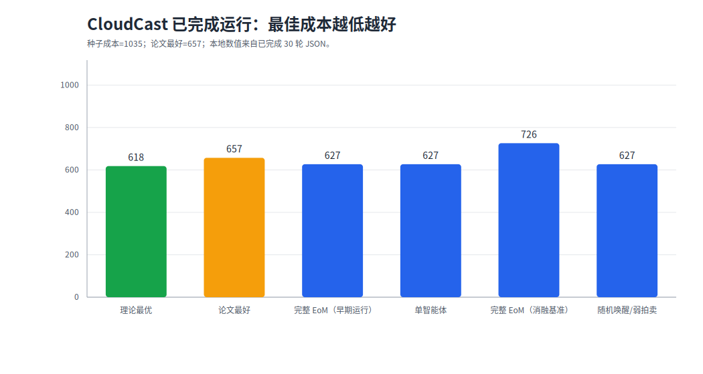
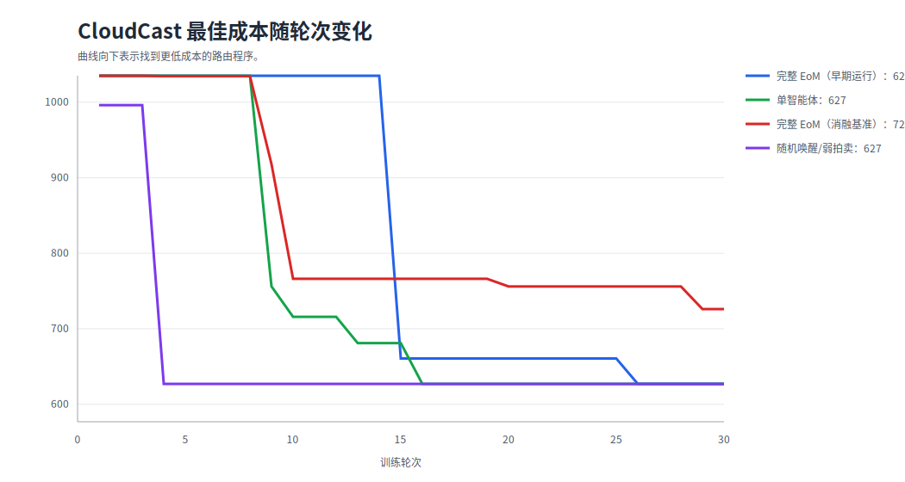
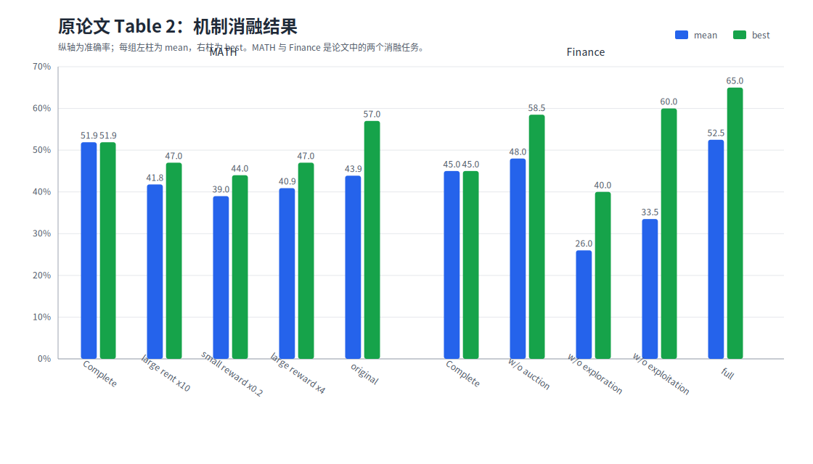
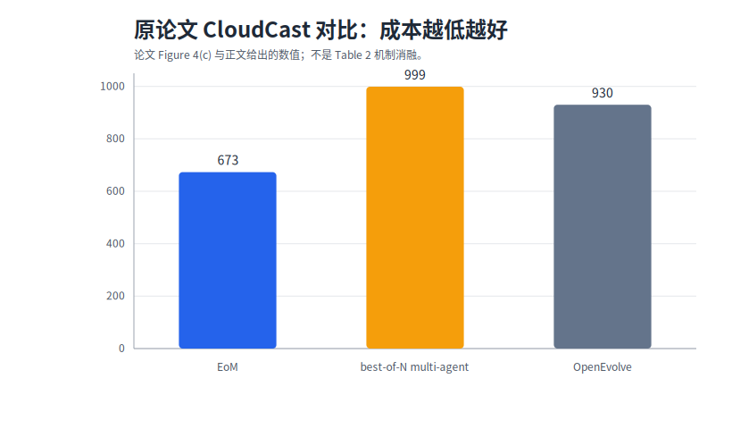
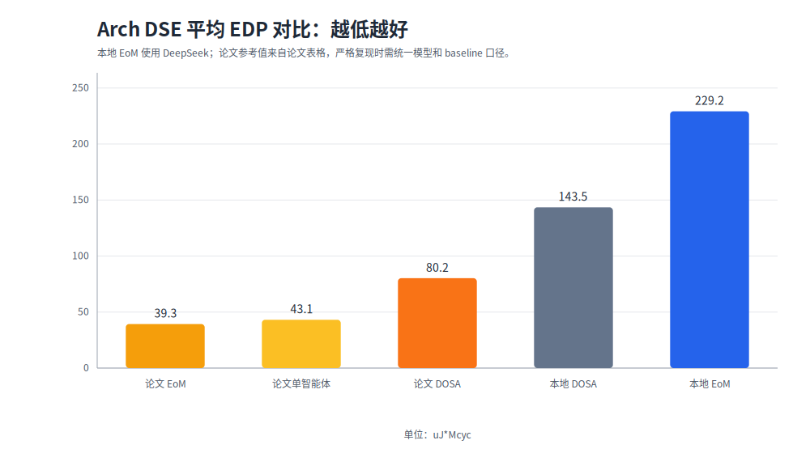
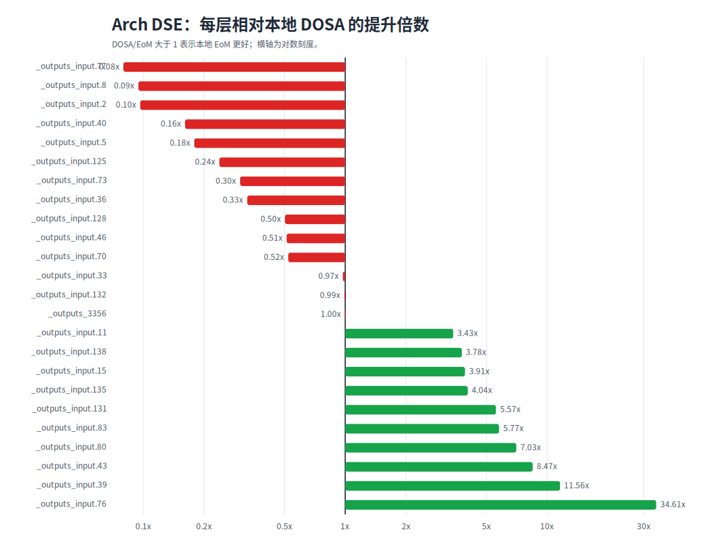
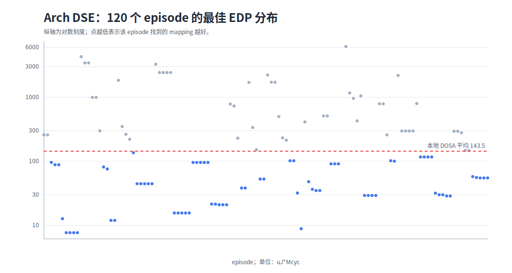

# 已完成实验结果整理

生成时间：2026-07-13 16:46:17

本报告只把当前仓库中**已经跑完**、并且结果文件可解析的实验放入主结果。仍在运行、中断或只完成一部分的实验放在最后的“未完成结果”里，避免把半截结果当成正式结论。

- **CloudCast**：已有 4 个完成 30 轮的运行，包括两次完整 EoM 重复运行、单智能体、随机唤醒/弱拍卖。
- **Arch DSE**：已有 1 个完整 120 episode 的 DeepSeek 正式运行，覆盖 24 个 ResNet-50 layer，每层 5 个 session。

## CloudCast 结果

CloudCast 的任务是优化多云广播路径，使总传输成本尽可能低。种子程序成本约为 `1035`，所以成本越低越好。按当前仓库 evaluator 的成本公式，可以把 5 个固定场景精确化为有向 Steiner 树问题；用动态规划求得当前评测口径下的理论最优总成本为 `618`。

| 运行 | 轮数 | 最佳成本 | 相对种子降低 | 结果文件 |
| --- | --- | --- | --- | --- |
| 完整 EoM（早期运行） | 30 | 627.0 | 39.42% | `outputs/cloudcast_deepseek_v4_pro_train.json` |
| 单智能体 | 30 | 627.0 | 39.42% | `outputs/cloudcast_ablations/single_coder_deepseek_v4_pro.json` |
| 完整 EoM（消融基准） | 30 | 726.0 | 29.86% | `outputs/cloudcast_ablations/baseline_deepseek_v4_pro.json` |
| 随机唤醒/弱拍卖 | 30 | 627.0 | 39.42% | `outputs/cloudcast_ablations/random_active_agent_deepseek_v4_pro.json` |

本地最好结果来自完整 EoM 早期运行、单智能体、随机唤醒/弱拍卖，最佳成本都是 `627.0`，低于论文 CloudCast 最好值 `657`，距离当前评测口径下的理论最优 `618` 还差 `9.0`。但不同配置的单次波动很大，需要重复实验才能证明机制优劣。

这张曲线显示：几个完成运行都在中后期突然找到更低成本方案。CloudCast 的结论更应该看多次重复实验的平均值，而不是只看某一次最好结果。

## 原论文消融对照

原论文在在 MATH 和 Finance-Agent-Bench 做了机制消融，MATH 主要扰动租金和奖励强度，Finance 主要移除拍卖、探索、利用等组件。

MATH 消融：

| 配置 | Mean | Best |
| --- | --- | --- |
| Complete | 51.9% | 51.9% |
| large rent x10 | 41.8% | 47.0% |
| small reward x0.2 | 39.0% | 44.0% |
| large reward x4 | 40.9% | 47.0% |
| original | 43.9% | 57.0% |

Finance-Agent-Bench 消融：

| 配置 | Mean | Best |
| --- | --- | --- |
| Complete | 45.0% | 45.0% |
| w/o auction | 48.0% | 58.5% |
| w/o exploration | 26.0% | 40.0% |
| w/o exploitation | 33.5% | 60.0% |
| full | 52.5% | 65.0% |

论文对 CloudCast 给的是基线对比，不是同款机制消融：

原论文 CloudCast 的核心数字是：EoM 最好成本 `673`，best-of-N multi-agent 最好成本 `999`，OpenEvolve 约 `930`。这能说明“仅仅多智能体重复采样不够，经济演化有帮助”。

## Arch DSE 结果

Arch DSE 的任务是为 ResNet-50 卷积层搜索加速器 mapping，使 EDP，也就是能耗延迟积，尽可能低。这里单位统一换算为 `uJ*Mcyc`，越低越好。

原论文硬件加速任务使用 24 个 ResNet-50 convolution kernels，并报告平均 EDP。下面把论文结果和本地结果放在同一张表里：

| 结果 | 平均 EDP，越低越好 | 来源 | 说明 |
| --- | --- | --- | --- |
| 论文 DOSA | 80.2 | 论文 Table 1 | 非 LLM baseline |
| 论文 ReAct | 43.1 | 论文 Table 1 | 完整单智能体 baseline |
| 论文 EoM | 39.3 | 论文 Table 1 | 论文主结果 |
| 本地 DOSA cache | 143.496 | 本仓库本地 cache | baseline 口径与论文 DOSA 不完全一致 |
| 本地 EoM DeepSeek | 229.168 | 本次运行 | 120 episode，119/120 成功 |

| 指标 | 数值 |
| --- | --- |
| 运行目录 | `outputs/arch_dse_world_3agent_parallel_deepseek_20260707_035316_862936` |
| episode 总数 | 120 |
| 成功 episode | 119/120 |
| 覆盖 layer | 24/24 |
| 本地 EoM 平均 EDP | 229.168 uJ\*Mcyc |
| 本地 DOSA 平均 EDP | 143.496 uJ\*Mcyc |
| 优于本地 DOSA 的 layer | 10/24 |
| 本地 DOSA / EoM 几何平均比值 | 1.1011x |

这次 Arch DSE 已经完整跑通流程：120 个 episode 中 119 个成功，24 个 layer 都有有效 mapping。但是性能没有达到论文标准。论文 EoM 平均 EDP 为 `39.3 uJ*Mcyc`，本地 DeepSeek 运行是 `229.168 uJ*Mcyc`；论文报告相对 DOSA 的几何平均提升约为 `2.2x`，本地运行是 `1.1011x`。

表现最好的 layer：

| layer | EoM EDP | DOSA EDP | DOSA/EoM |
| --- | --- | --- | --- |
| \_outputs_input.76 | 7.692 | 266.192 | 34.61x |
| \_outputs_input.39 | 11.954 | 138.248 | 11.56x |
| \_outputs_input.43 | 8.863 | 75.065 | 8.47x |
| \_outputs_input.80 | 29.242 | 205.557 | 7.03x |
| \_outputs_input.83 | 88.422 | 510.233 | 5.77x |

表现最差的 layer：

| layer | EoM EDP | DOSA EDP | DOSA/EoM |
| --- | --- | --- | --- |
| \_outputs_input.77 | 425.937 | 33.982 | 0.08x |
| \_outputs_input.8 | 993.396 | 94.039 | 0.09x |
| \_outputs_input.2 | 2427.286 | 234.776 | 0.10x |
| \_outputs_input.40 | 232.114 | 37.405 | 0.16x |
| \_outputs_input.5 | 15.590 | 2.790 | 0.18x |

这个结果说明系统不是完全无效：它在 10/24 个 layer 上优于本地 DOSA cache，其中 `_outputs_input.76` 的提升达到 `34.61x`。但坏处也很明显：部分 layer 远差于 DOSA，拉高了平均 EDP，所以不能说已经复现论文里的 Arch DSE 性能。
